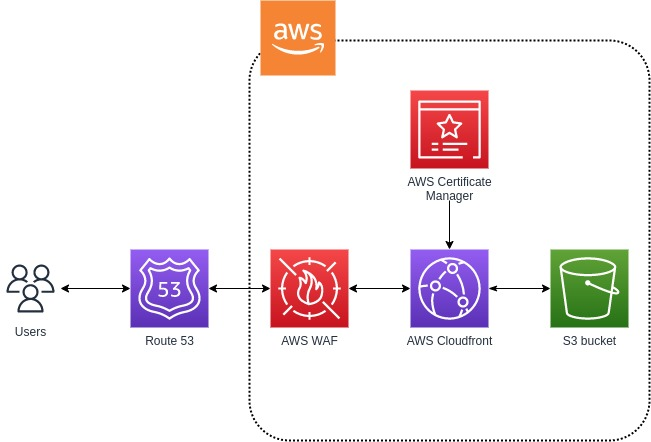

# WM_Platform
WM platform exercise

Your task is to build a reusable module for a SPA (Single Page Application) implementation on
AWS. You can use Terraform, CloudFormation, CDK, or SAM. Base requirements:

● It should use S3 for hosting. EC2/ECS should not be used

● It should support a custom domain name

● It should support SSL

● It should support custom WAF rules

● SPA is deployed by pushing static index.html and other web resources

● Bonus: Support a CORS use-case so the website can call an external API gateway (the URL/identity for API gateway can be passed as parameter)

## Design Choices:

1. Domain name reroute done using Route53
2. SSL termination happens at cloudfront where a custom certificate is generated for the domain name and uploaded to cloudfront distribution
3. A WAF ACL is created and attached to the cloudfront distribution
4. SPA is deployed on to a S3 bucket where static web hosting is enabled and the objects are made public
5. A cors rule is added to S3 and the url is passed as the parameter

## Explanations:
1. S3 for hosting - Requirement
2. Route53 - Intragrates well AWS services
3. ACM - Easy automation using terraform and integrates with AWS services
4. AWS WAF - Configurable custom rules can be done on AWS WAF and integrates well with AWS services
5. Cloudfront - Reduced latency, WAF acl integration, Improved AWS security and integrates well with AWS resources like S3 and ACM
## Assumptions:
1. The Route 53 hosted zone's nameservers are copied to the respective domain registrars.
2. The backend s3 configuration is prefilled at WM_Platform/terraform/application/env/prod/backend.tfvars before running the script spa_deploy.sh - replace \<tf-state-bucket\> with state s3 bucket and "\<tf-lock-dynamodb-table\>" with Lock table
3. No Manual step is required on AWS

## Script

The all compassing script is the file spa_deploy.sh

Usage: $bash spa_deploy.sh \<AWS_REGION\> \<AWS_PROFILE\> \<WORKSPACE\> \<DOMAIN_NAME\> 

Ex: $bash spa_deploy.sh us-east-1 profile_prod prod wmexecercise.com 

AWS_REGION: The aws region on which resources are deployed

AWS_PROFILE: The aws profile which has proper permissions to execute the script

WORKSPACE: The terraform workspace for better state management

DOMAIN_NAME: The Domain for SPA

## Thought process

Trello link: https://trello.com/b/WuU0nrkl/devops-task

## Additional Features:
1. OAI for cloudfront access to S3 bucket
2. Backend configuration for terraform
3. automation of acm certificates using email as well as dns verifications
4. Custom WAF rules attached to cloudfront